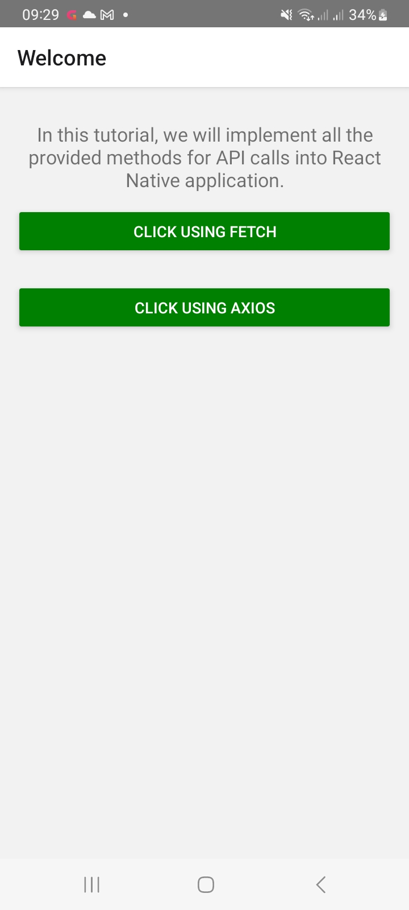
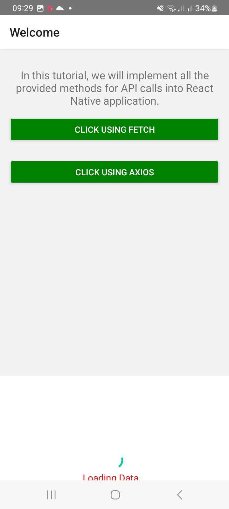

# React Native API calls with Fetch and Axios using CLI


React Native Image Picker for android and ios




    	# App features
    	1. Pick image from camera and gallery from phone
    	2.  includeBase64
    	3.storageOptions: {
        skipBackup: true,
        path: 'images',
      }


    	# Reference

    	1. [Used rect-native-image-picker](https://github.com/react-native-image-picker/react-native-image-picker)

## Created with:

- React Native CLI.
- Android version: 14
- SDK version: 34

# Getting Started

## Step 1: Start the Metro Server


```bash
# using npm
npm start

# OR using Yarn
yarn start
```

### For Android

```bash
# using npm
npm run android

# OR using Yarn
yarn android
```

### For iOS

```bash
# using npm
npm run ios

# OR using Yarn
yarn ios
```


To learn more about React Native, take a look at the following resources:

- [React Native Website](https://reactnative.dev) - learn more about React Native.
- [Getting Started](https://reactnative.dev/docs/environment-setup) - an **overview** of React Native and how setup your environment.
- [Learn the Basics](https://reactnative.dev/docs/getting-started) - a **guided tour** of the React Native **basics**.
- [Blog](https://reactnative.dev/blog) - read the latest official React Native **Blog** posts.
- [`@facebook/react-native`](https://github.com/facebook/react-native) - the Open Source; GitHub **repository** for React Native.
